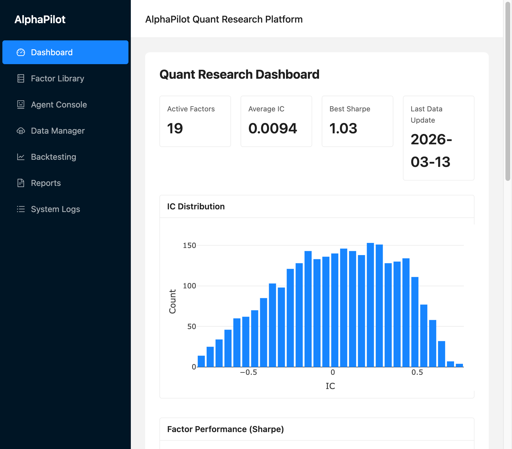
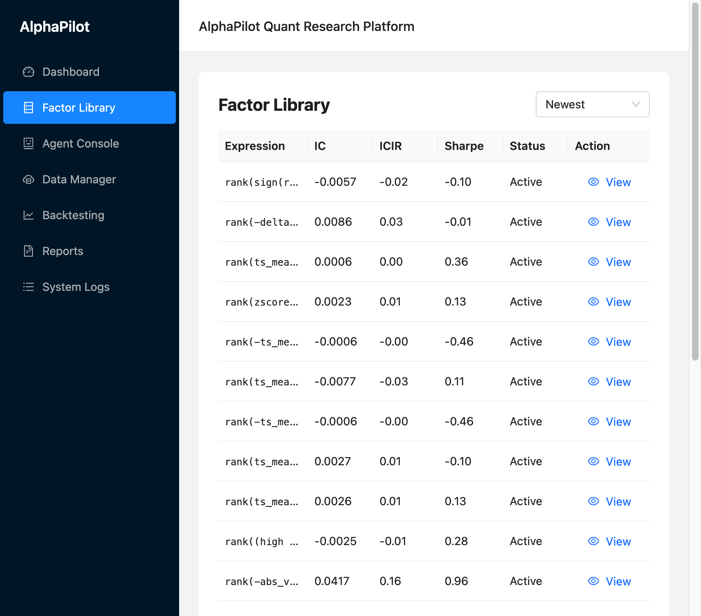

# AlphaPilot - LLM-Agent 驱动的自动化量化因子研究平台

> 基于个人爱好，将当下热门 AI 技术（LLM、Agent、RAG）与量化研究结合的尝试。  
> **本人在量化经验和 AI 项目开发的经验都很浅薄，制作出的项目也比较简陋，希望各位大佬指正，提出优化建议，感激不尽！**

## 界面预览

| Dashboard 概览 | Factor Library 因子库 |
|:---:|:---:|
|  |  |

## 项目简介

多智能体系统，用于自动化 Alpha 因子发现，包含 Planner、Generator、Evaluation、Backtest、Report 等 Agent。

## 架构

```
用户 / 研究目标
        ↓
Planner Agent（任务分解）
        ↓
Orchestrator（任务调度）
        ↓
┌───────────────────────────────────────┐
│ Generator Agent   → 因子候选          │
│ Evaluation Agent  → IC 指标、入库     │
│ Backtest Agent    → Sharpe、最大回撤  │
│ Report Agent      → Markdown 报告     │
└───────────────────────────────────────┘
        ↓
Skills / 工具层（generate_factor, evaluate_factor, backtest_strategy 等）
        ↓
Engine + Factor DB + RAG
```

## 环境配置

```bash
cd AlphaPilot-v1.1
pip install -r requirements.txt
cp .env.example .env
# 编辑 .env，设置 OPENAI_API_KEY（DeepSeek 或 OpenAI）
```

## 使用方式

### 命令行

```bash
# 默认研究目标
python main.py

# 自定义研究目标
python main.py --goal "发现高 ICIR 的动量因子"

# 强制重新下载行情数据
python main.py --force-download

# 限制轮次和迭代次数
python main.py --max-rounds 1 --max-iterations 10
```

### Web 平台

**后端（FastAPI）**
```bash
python run_web.py
# API: http://localhost:8000
```

**前端（React）**
```bash
cd frontend
npm install
npm run dev
# 界面: http://localhost:5173
```

**生产部署**
```bash
cd frontend && npm run build
python run_web.py
# 同时提供 API 和前端: http://localhost:8000
```

## 输出文件

- `output/factor_results.csv` - 因子表达式与评估摘要
- `output/reports/research_YYYYMMDD_HHMMSS.md` - LLM 生成的研究报告
- `factor_db/` - SQLite + Chroma 因子存储与检索

## 技术栈

- **后端**：Python、LangChain、FastAPI、Pandas、NumPy、SciPy
- **向量检索**：ChromaDB、sentence-transformers
- **前端**：React、TypeScript、Ant Design、Plotly
- **数据**：yfinance、SQLite

## 上传到 GitHub

详见 [docs/GITHUB_UPLOAD.md](docs/GITHUB_UPLOAD.md)。

## 致谢

感谢所有开源项目与社区的支持。欢迎 Star、Fork，以及提出 Issue 和 PR！
